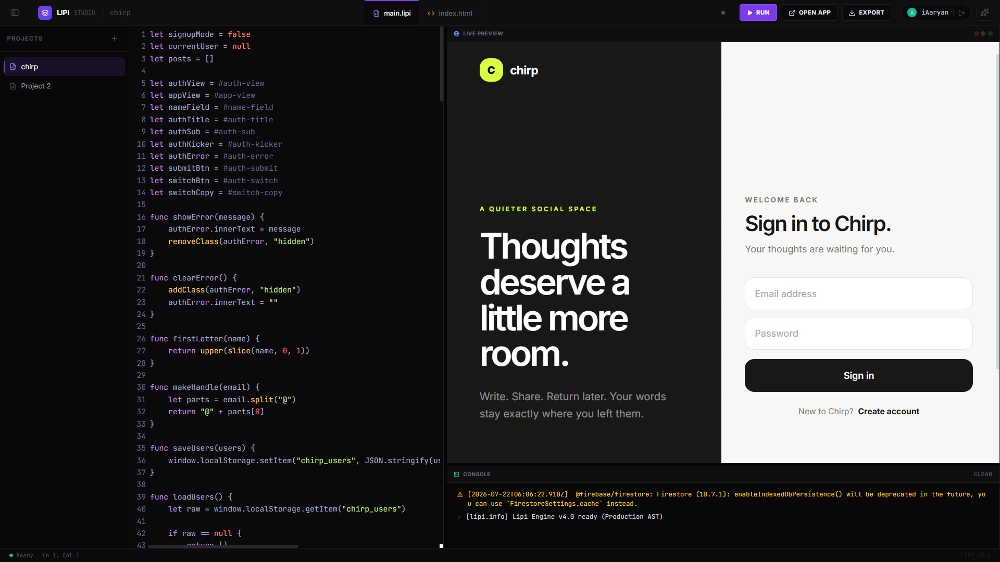
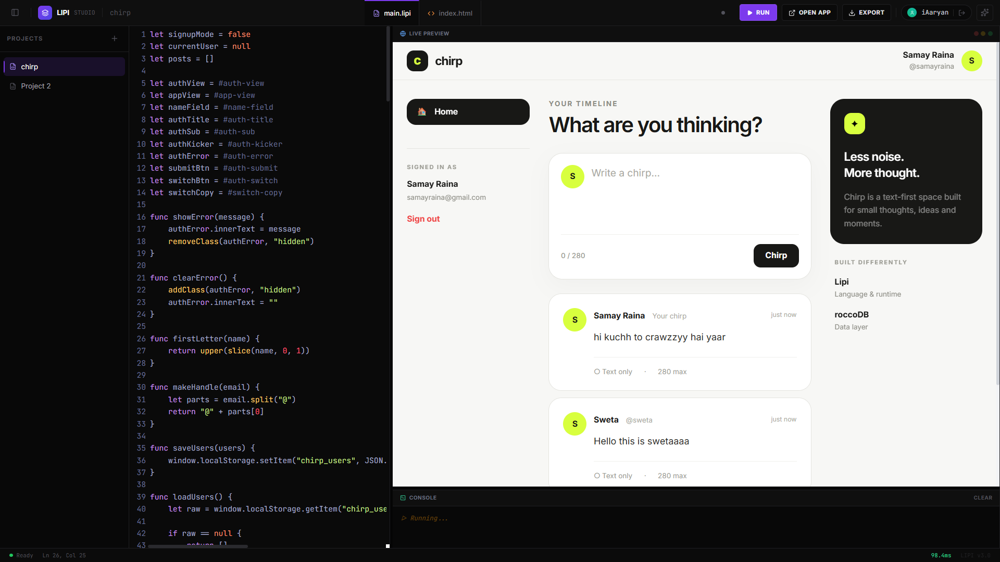
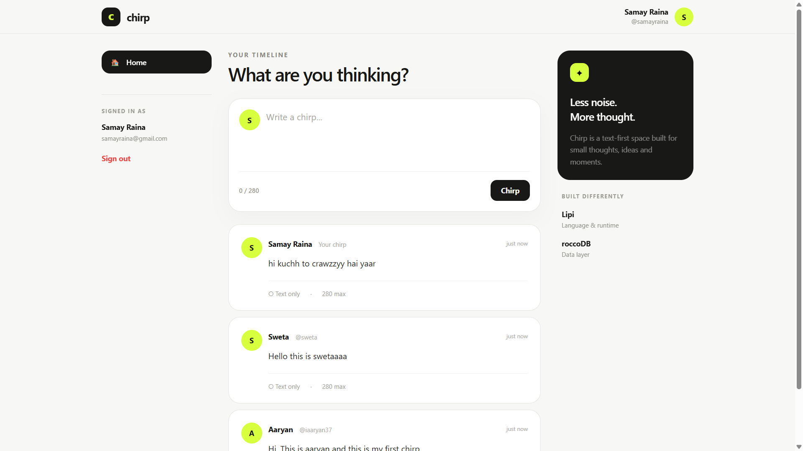

# LIPI Studio — v3.0.0

> Build browser apps in LIPI and persist real data with roccoDB.

<p align="center">
  
</p>

LIPI is a small web-native programming language (its own lexer, Pratt-parser,
AST, and JS code generator) that runs in the browser, plus **LIPI Studio**: a
CodeMirror-based IDE with Firebase-backed multi-project sync, a live preview,
a console, an AI assistant, and a real database — **roccoDB**, a custom
C++20 embedded NoSQL store — wired in through a small Node.js/Express bridge.

This README documents the actual, current implementation only. Nothing here
describes a feature that isn't in the codebase.

---

## 1. Project structure

```
.
├── index.html            Landing page
├── account.html          Firebase auth (sign in / sign up)
├── editor.html            Studio shell (loads editor.js, project-manager.js, ai-panel.js, editor-sync.js, lipi.js)
├── editor.js               CodeMirror editor, RUN, Open App, Publish, Export App
├── editor-sync.js           Firebase init + auth observer (ES module)
├── project-manager.js      Multi-project CRUD + Firestore realtime sync + Publish/Unpublish
├── ai-panel.js              AI assistant UI — talks to the backend AI proxy only
├── lipi.js                  The LIPI language: Lexer, Parser, CodeGen, runtime, db bridge client
├── app.html                  Public, unauthenticated "published app" viewer
├── firestore.rules         Security rules (private projects + public `published/*`)
├── server/
│   └── db-bridge.js        Express bridge: roccoDB + Firebase-auth-verified REST/SSE API + AI proxy
├── .env.example
└── README.md
```

roccoDB itself (`roccodb-iaaryan` on npm) is a native C++20 Node addon and
**only runs inside Node.js** — never in the browser. `server/db-bridge.js` is
the only thing that talks to it directly; the browser talks to
`server/db-bridge.js` over HTTP + Server-Sent Events.

```
Browser (lipi.js: dbInsert/dbGet/dbUpload/dbOnChange)
        │  HTTPS + Firebase ID token
        ▼
server/db-bridge.js  (Express, verifies the token, then calls roccoDB)
        │
        ▼
roccoDB (C++20 engine, local folder storage, OUTSIDE any watched frontend dir)
```

---

## 2. Quick start

### 3.1 Use the hosted Studio

The easiest way to use LIPI is the hosted Studio:

1. Open the LIPI Studio deployment.
2. Sign up or sign in with Firebase Authentication.
3. Create a project.
4. Write UI in `index.html`.
5. Write application logic in `main.lipi`.
6. Click **RUN**.

Database calls from LIPI are sent to the deployed roccoDB bridge over HTTPS.
The browser never loads the native database addon directly.

### 3.2 First real roccoDB record

Paste this into `main.lipi`:

```lipi
let saved = dbInsert("users", {
  name: "Aaryan",
  project: "LIPI",
  message: "roccoDB is working!"
})

log("INSERT RESULT:")
log(saved)

let user = dbGet("users", saved)

log("READ RESULT:")
log(user)
```

Expected flow:

```text
LIPI code
   ↓
dbInsert("users", {...})
   ↓
HTTPS request + Firebase ID token
   ↓
Node.js / Express database bridge
   ↓
roccoDB C++20 engine
   ↓
generated record id returned to LIPI
   ↓
dbGet("users", id)
   ↓
saved document returned
```

`dbInsert()` returns the new record ID. `dbGet()` reads one record, so it
requires both the collection name and that ID.

---

## 3. Local development setup

### 3.1 Install dependencies

```bash
# Frontend has no build step — it's static HTML/JS.
# Backend bridge:
mkdir server && mv db-bridge.js server/db-bridge.js   # if not already there
cd server
npm init -y
npm install express cors helmet express-rate-limit multer firebase-admin roccodb-iaaryan
```

Node.js **18+** is required (the AI proxy uses the built-in global `fetch`).
`roccodb-iaaryan` contains a native addon — make sure you have build tools
available for your platform (e.g. `build-essential`/Xcode CLT/`windows-build-tools`).

### 3.2 Configure environment variables

Create `server/.env` (or export these in your process manager):

```bash
PORT=4000
ROCCO_DB_PATH=./data                 # roccoDB data folder — keep OUTSIDE your frontend's watched dir
ALLOWED_ORIGIN=http://localhost:5500,https://your-studio-domain.com

# Firebase Admin — verifies the ID tokens sent by the browser
FIREBASE_SERVICE_ACCOUNT=./firebase-service-account.json
# or rely on GOOGLE_APPLICATION_CREDENTIALS / applicationDefault()

# LOCAL DEV ONLY — never set this in production
DB_BRIDGE_DISABLE_AUTH=false

DB_BRIDGE_MAX_UPLOAD_MB=15

# AI assistant (Groq) — kept server-side only, never sent to the browser
GROQ_API_KEY=gsk_your_key_here
GROQ_MODEL=llama-3.3-70b-versatile
```

Get a free Groq key at https://console.groq.com. If `GROQ_API_KEY` is unset,
the AI panel still loads — it just returns a clear "not configured" error
instead of a raw failure.

### 3.3 Run the backend bridge

```bash
cd server
node db-bridge.js
# [db-bridge] roccoDB bridge listening on :4000 (data dir: ./data)
```

### 3.4 Serve the frontend

Any static file server works — the Studio itself has no build step.

```bash
npx serve .           # or: python3 -m http.server 5500, nginx, Firebase Hosting, etc.
```

Open `index.html` → sign up/sign in via `account.html` → you land in
`editor.html` (Studio).

If your bridge isn't at `http://127.0.0.1:4000/api/db`, set
`window.LIPI_DB_API` before `lipi.js` loads — this is already wired up as a
small inline `<script>` block at the top of `editor.html` and `app.html`.

### 3.5 Deploy Firestore security rules

```bash
firebase deploy --only firestore:rules
```

See `firestore.rules` — private projects live under `users/{uid}/projects/*`
and are readable/writable only by their owner. Publishing writes a
deliberate, separate snapshot to `published/{projectId}`, which is
public-read but owner-only write. Publishing never makes your private
project tree readable by anyone else.

---

## 4. The LIPI language

```lipi
let x = 42
let name = "Ada"
let greeting = `Hi {name}!`

if x > 5 { log("big") } else if x == 3 { log("three") } else { log("small") }

func add(a, b) { return a + b }        # user functions are internally async

let box = #demo-box                     # DOM selection: #id or $("css selector")
on box.click {
  box.innerText = "clicked"
  wait(300)                             # pauses cleanly — no `await` needed in user code
  box.style.bg = "#7c3aed"              # style shortcuts: bg, fg, size, weight, radius, shadow...
}

for i in range(0, 10, 2) { log(i) }
for k in { a: 1, b: 2 } { log(k) }

let id = dbInsert("notes", { text: "hello" })   # async under the hood — no `await` written
let doc = dbGet("notes", id)
dbOnChange("notes", (evt) => log(evt))          # returns an unsubscribe function
```

**Execution model:** Source → Lexer → Parser → AST → CodeGen → JavaScript
(wrapped in an async IIFE) → `new Function(...)`. User-declared functions are
compiled to `async function` and calls to them are auto-awaited by the
compiler; `wait()`, `getInput()`, and the three one-shot roccoDB calls
(`dbInsert`, `dbGet`, `dbUpload`) are auto-awaited too. `dbOnChange` is
**not** auto-awaited — it returns an unsubscribe function synchronously.

Built-ins: `range len str int float bool type has` · array:
`append pop push sort reverse filter map find includes indexOf slice join
split sum avg copy deepCopy` · string: `upper lower trim replace startsWith
endsWith contains repeat split` · object: `keys values merge copy deepCopy
toJSON fromJSON` · DOM: `show hide clear setText setHTML queryAll addClass
removeClass toggleClass` · async: `wait/sleep`, `getInput`.

---

## 5. roccoDB integration — API reference

Four LIPI globals, unchanged from the original spec, all backed by
`server/db-bridge.js`:

| LIPI call | Backend route | Auth |
|---|---|---|
| `dbInsert(collection, doc)` → `id` | `POST /insert` | Firebase ID token required |
| `dbGet(collection, id)` → `doc \| null` | `GET /get` | Firebase ID token required |
| `dbUpload(fileOrSelector, collection?, meta?)` → `ref` | `POST /upload` (multipart) | Firebase ID token required |
| `dbOnChange(collection, cb)` → `unsubscribe()` | `GET /stream` (SSE) | Firebase ID token required |

Every insert/upload is stamped server-side with `_createdBy` (the verified
uid) and `_createdAt`. Collection names are restricted to
`[a-zA-Z0-9_-]{1,64}` to keep them safe as roccoDB's folder-based collection
names. The bridge fans a single roccoDB `onChange` listener per collection
out to every subscribed SSE client, so N open tabs/streams cost one native
listener, not N.

**Why data can't cause a reload loop:** `ROCCO_DB_PATH` must point outside
any directory your dev file-watcher/Live-Server watches. The bridge process
is a separate Node process from your static file server, so a roccoDB write
never touches a file your frontend dev server is watching.

**Why repeated RUN is safe:** `Lipi.run()` now tears down a run-session
registry before compiling/executing new code — every `dbOnChange` stream
opened by the previous run is closed first, so clicking RUN five times
leaves exactly one active subscription, not five.

---

## 6. Studio features

- **Run** — compiles and executes the current project in the live preview.
- **Open App** — bundles the current project into a self-contained HTML
  document (Blob URL) and opens it in a new tab with no Studio UI.
- **Publish** — writes a public snapshot to `published/{projectId}` in
  Firestore and shows a shareable URL (`app.html?id=...`). Anyone with the
  link can view a **read-only snapshot** of the app; it is not a live view
  of your editor, and it does not expose your other projects. **Unpublish**
  deletes the snapshot.
- **Export App** — downloads a runnable `.zip` (`index.html`, `lipi.js`,
  `project.lipi`, `README.md`) that runs on any static file host with zero
  build step. If the exported app uses `dbInsert`/`dbGet`/`dbUpload`/
  `dbOnChange`, it still needs a reachable `server/db-bridge.js` — the
  exported `README.md` inside the zip says so explicitly.
- **AI assistant** — a Lipi-language-aware chat panel. Requests go through
  `POST {LIPI_DB_API}/ai/chat`, an authenticated proxy that holds
  `GROQ_API_KEY` server-side and streams the model's response back. The key
  is never present in any frontend file or in `localStorage`.

---

## Screenshots

### LIPI Studio

The browser-based IDE provides syntax highlighting, project management, live preview, and one-click execution for LIPI applications.

<p align="center">
  
</p>

---

### Live Preview — Chirp Application

A complete social media application built and executed inside the LIPI Studio, demonstrating the compiler, runtime, and live preview working together.

<p align="center">
  
</p>


## 7. Production deployment

The production architecture uses two separate deployments:

```text
Netlify
  └── LIPI Studio frontend (static HTML/CSS/JS)
          │
          │ HTTPS + Firebase ID token
          ▼
Render
  └── Node.js / Express db bridge
          │
          ▼
      roccoDB
```

### 7.1 Deploy the backend bridge to Render

Deploy the repository as a Node.js Web Service and run:

```bash
cd server
npm install
npm start
```

The bridge must bind to Render's `PORT` environment variable. The current
server code already uses:

```js
const PORT = parseInt(process.env.PORT || "4000", 10)
```

Configure production environment variables in the Render service:

```bash
ROCCO_DB_PATH=/tmp/roccodb
ALLOWED_ORIGIN=https://your-site.netlify.app
DB_BRIDGE_DISABLE_AUTH=false
DB_BRIDGE_MAX_UPLOAD_MB=15

# Firebase Admin credentials:
FIREBASE_SERVICE_ACCOUNT=/path/to/service-account.json
# or GOOGLE_APPLICATION_CREDENTIALS / applicationDefault()
```

For production, Firebase Admin must be initialized correctly. Never use
`DB_BRIDGE_DISABLE_AUTH=true` on a public deployment.

Verify the deployment before connecting the frontend:

```text
GET https://your-render-service.onrender.com/api/db/health
```

Expected response:

```json
{
  "ok": true
}
```

### 7.2 Point LIPI Studio to the deployed bridge

Set the database API URL before `lipi.js` loads:

```html
<script>
  window.LIPI_DB_API =
    "https://your-render-service.onrender.com/api/db"
</script>

<script src="lipi.js"></script>
```

Do this anywhere the LIPI runtime can execute database code, including the
Studio editor page and the published-app viewer.

If DevTools shows a request to `127.0.0.1:4000` after deployment, the frontend
is still using the local bridge URL.

### 7.3 Deploy the frontend to Netlify

LIPI Studio is a static frontend, so there is no build step. Deploy the
frontend files from the repository root.

Include the frontend application files such as:

```text
index.html
account.html
editor.html
editor.js
editor-sync.js
project-manager.js
ai-panel.js
app.html
lipi.js
firestore.rules
docs/
```

Do not deploy these frontend secrets or backend-only files:

```text
server/.env
Firebase service-account JSON files
node_modules/
local roccoDB data folders
```

The `server/` directory is not needed by Netlify when the backend is already
running separately on Render.

After deploying:

1. Add the exact Netlify origin to `ALLOWED_ORIGIN` on the Render service.
2. Redeploy or restart the backend if the environment changed.
3. Open the Netlify site and sign in.
4. Create a LIPI project.
5. Run the insert/read test.
6. Confirm that `dbInsert()` returns an ID and `dbGet()` returns the document.

### 7.4 Production test app

Use this HTML:

```html
<div class="app">
  <h1>roccoDB Test 🚀</h1>
  <p>LIPI → roccoDB → Render → Production</p>

  <input id="name-input" placeholder="Enter your name">
  <button id="save-btn">Save to roccoDB</button>

  <div id="status">Ready...</div>

  <div class="card">
    <h3>Saved Record</h3>
    <p id="result">Nothing saved yet.</p>
  </div>
</div>

<style>
  body {
    margin: 0;
    min-height: 100vh;
    display: grid;
    place-items: center;
    background: #0b0b0f;
    color: white;
    font-family: Arial, sans-serif;
  }

  .app {
    width: 360px;
    padding: 32px;
    background: #15151c;
    border: 1px solid #292933;
    border-radius: 20px;
  }

  h1 { color: #9b6cff; }

  input, button {
    box-sizing: border-box;
    width: 100%;
    padding: 14px;
    margin-top: 12px;
    border-radius: 10px;
    border: none;
  }

  input {
    background: #22222c;
    color: white;
  }

  button {
    background: #7c3aed;
    color: white;
    font-weight: bold;
    cursor: pointer;
  }

  .card {
    margin-top: 20px;
    padding: 16px;
    background: #202029;
    border-radius: 12px;
  }

  #status {
    margin-top: 16px;
    color: #aaa;
  }
</style>
```

Use this LIPI code:

```lipi
let nameInput = #name-input
let saveBtn = #save-btn
let status = #status
let result = #result

on saveBtn.click {
  let name = nameInput.value

  status.innerText = "Saving to roccoDB..."

  let saved = dbInsert("production-test", {
    name: name,
    message: "Hello from deployed LIPI!",
    source: "Netlify Production"
  })

  log("INSERT RESULT:")
  log(saved)

  let record = dbGet("production-test", saved)

  log("READ RESULT:")
  log(record)

  status.innerText = "Success! Record saved and read back 🎉"
  result.innerText =
    "Name: " + record.name + " | Message: " + record.message
}
```

A successful test proves the complete path works:

```text
Netlify frontend
  → LIPI runtime
  → authenticated HTTPS request
  → Render bridge
  → roccoDB write
  → generated ID
  → roccoDB read
  → document returned to the browser
```

---

## 8. Security notes

- The Groq API key lives only in `server/.env` on the backend; the browser
  never sees it (`server/db-bridge.js` → `/ai/chat`).
- roccoDB calls require a valid Firebase ID token, verified server-side with
  `firebase-admin`; `DB_BRIDGE_DISABLE_AUTH=true` is for local dev only and
  logs a warning on startup.
- Collection names are allow-listed to prevent path-traversal into roccoDB's
  folder-based storage.
- Publishing writes an explicit snapshot the owner chose to make public — it
  never grants read access to the private `users/{uid}/projects/*` tree (see
  `firestore.rules`).
- CORS is locked to `ALLOWED_ORIGIN` in production; set it before deploying.

---

## 9. Troubleshooting

| Symptom | Likely cause |
|---|---|
| `Lipi engine not loaded` in console | `lipi.js` failed to load before `editor.js` ran — check script order in `editor.html`. |
| `dbInsert`/`dbGet` reject with `401` | Missing/expired Firebase ID token, or Firebase Admin isn't initialized correctly on the bridge. |
| `network error reaching db bridge (Failed to fetch)` | Wrong `LIPI_DB_API`, bridge is sleeping/offline, CORS rejected the frontend origin, or the frontend still points to `127.0.0.1:4000`. |
| `dbGet: "id" is required` | `dbGet` reads one record. Pass the ID returned by `dbInsert`, e.g. `dbGet("users", saved)`. |
| Render says `applicationDefault` is undefined | Firebase Admin initialization is using the wrong API shape/version. Initialize the Admin SDK with a supported credential method and verify the installed `firebase-admin` version. |
| Render deploy exits before becoming live | Check startup logs first. The bridge intentionally fails closed if Firebase Admin cannot initialize while auth is enabled. |
| Live Server keeps reloading after a DB write | `ROCCO_DB_PATH` points inside a folder your static dev server is watching — move it outside. |
| AI panel says "not configured on this server" | `GROQ_API_KEY` isn't set in the bridge's environment. |
| `dbOnChange` stops firing after several RUNs | Should no longer happen (session teardown fix in `lipi.js` §"RUN-SESSION REGISTRY") — if it does, check the browser console for SSE connection errors. |
| Publish button fails silently | Firestore rules not deployed, or the user isn't signed in. |

---

## 10. Original roccoDB package docs

The underlying `roccodb-iaaryan` npm package's own API (`RoccoDB`,
`db.collection()`, `.insert()`, `.get()`, `.onChange()`,
`db.storage.upload()`) is documented in that package directly — see
https://www.npmjs.com/package/roccodb-iaaryan. `server/db-bridge.js` is a
thin, security-hardened HTTP/SSE wrapper around exactly that API; it does
not add features roccoDB itself doesn't have (e.g. no update/delete, no
querying beyond get-by-id — those are upstream roccoDB limitations, not
bridge limitations).

## License

ISC

## Keywords

LIPI Programming Language
Browser Programming Language
Web IDE
Compiler
Parser
Lexer
AST
JavaScript Code Generator
roccoDB
NoSQL Database
Embedded Database
Firebase
Node.js
Express
AI IDE
CodeMirror
Programming Language from Scratch
Custom Programming Language
Browser Compiler
Cloud IDE
